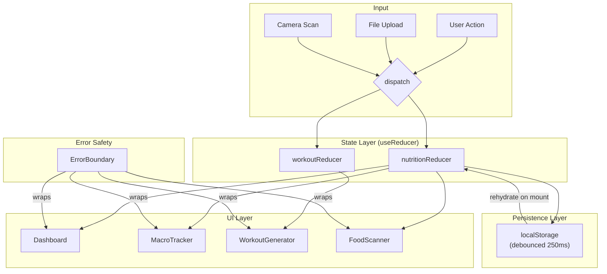

<div align="center">

# ⚡ FitPulse Elite

**AI-powered fitness intelligence — food scanning, adaptive workouts, and biometric analytics in one unified dark-mode dashboard.**

[](https://your-demo-url.vercel.app)

---


</div>

---

> **🎥 [Live Demo](https://your-demo-url.vercel.app)** — Scan food, generate workouts, track biometrics.

---

## ✦ Features

### 🔬 ML Computer Vision Food Scanner
Point your camera at any meal and get instant calorie and macro breakdown. Handles all camera permission states gracefully — denied camera falls back to file upload, which routes through the identical analysis pipeline. No camera, no problem.

### 🏋️ Custom Muscle AI Workout Generator
Select a muscle group (or type anything custom) and receive a periodized, RPE-calibrated workout in seconds. Built with a `useReducer` state machine — `GENERATE_ERROR` always clears `isGenerating` to prevent the most common async state-leak bug in React.

### 📊 Real-Time Macro Dashboard
Logs meals with instant recalculation via `recalculateTotals()` — totals are always recomputed from the array, never incremented/decremented. Survives hard refresh via localStorage persistence with 250ms debounce.

### 📈 Biometric Analytics
Progressive overload tracking, PR history, and performance trend visualization across all major compound lifts.

---

## 🏗 Architecture



---

## 🛠 Tech Stack

| Technology | Why it was chosen |
|---|---|
| **React 19** | Concurrent features; no overhead of a meta-framework needed for a SPA |
| **Vite 8** | Sub-second HMR; tree-shaking eliminates dead code in production builds |
| **Tailwind CSS 3** | Utility-first prevents CSS specificity battles; content glob covers all `.jsx` paths |
| **useReducer + localStorage** | Zero-dependency state: atomic multi-field updates, action-based transitions, predictable diffs — without Redux's boilerplate or `useState`'s stale-closure risk on rapid dispatches |
| **Framer Motion 13** | Declarative physics-based animations; `AnimatePresence` handles exit states React can't |
| **Vitest + RTL** | Co-located with Vite config; JSDOM environment mirrors the browser DOM without a separate Jest process |

---

## 🚀 Getting Started

### Prerequisites
- Node.js ≥ 18
- npm ≥ 9

### Install & Run

```bash
# 1. Clone
git clone https://github.com/your-username/fitpulse-elite.git
cd fitpulse-elite

# 2. Install dependencies
npm install

# 3. Configure environment
cp .env.example .env
# Fill in your API keys in .env

# 4. Start dev server
npm run dev

# 5. Production build
npm run build
npm run preview
```

### Environment Variables

| Variable | Purpose |
|---|---|
| `VITE_ANTHROPIC_API_KEY` | Claude API — AI Coach responses |
| `VITE_CLARIFAI_PAT` | Clarifai — Computer Vision food recognition |
| `VITE_GEMINI_API_KEY` | Gemini — Workout generation fallback |

---

## 📁 Project Structure

```
fitpulse-elite/
├── src/
│   ├── components/
│   │   ├── Dashboard.jsx          # KPI grid + meal summary
│   │   ├── ErrorBoundary.jsx      # Themed fallback — no white screens
│   │   ├── MacroTracker.jsx       # TDEE calculator + meal log
│   │   ├── WorkoutGenerator.jsx   # AI workout UI shell
│   │   ├── BiometricAnalytics.jsx # PR tracking + trends
│   │   ├── Scanner/
│   │   │   └── FoodScanner.jsx    # Camera → file → analysis pipeline
│   │   ├── Workout/
│   │   │   └── WorkoutGenerator.jsx  # Reducer-backed generator
│   │   ├── Layout/
│   │   │   └── AppLayout.jsx      # Sidebar + header shell
│   │   └── UI/
│   │       ├── Button.jsx         # Polymorphic button system
│   │       ├── Card.jsx           # Elite card variants
│   │       ├── EmptyState.jsx     # Zero-state placeholder
│   │       └── SkeletonLoader.jsx # Themed loading skeleton
│   ├── store/
│   │   ├── nutritionReducer.js    # Meal log state machine
│   │   ├── workoutReducer.js      # Workout generation state machine
│   │   └── __tests__/            # Pure-function reducer unit tests
│   ├── hooks/
│   │   ├── useNutrition.js        # useReducer + debounced localStorage
│   │   ├── useLocalStorage.js     # Generic persistent state hook
│   │   └── __tests__/            # Hook unit tests
│   ├── utils/
│   │   ├── constants.js           # Design tokens + breakpoints
│   │   └── workoutAI.js          # Exercise DB + generation engine
│   ├── styles/
│   │   ├── components.css         # Card, button, badge utilities
│   │   ├── layout.css             # Sidebar, grid, responsive
│   │   └── animations.css         # Keyframes + motion presets
│   └── index.css                  # :root variables + Tailwind directives
├── docs/
│   ├── ARCHITECTURE.md            # Deep-dive: reducers, ML pipeline, design system
│   └── assets/                    # GIFs and annotated screenshots
├── .env.example                   # API key template
├── CONTRIBUTING.md
└── LICENSE
```

---

## 🧪 Testing

```bash
# Run all tests (one-shot)
npm test

# Watch mode
npm run test:watch
```

**Current coverage:**

| Suite | Tests | Status |
|---|---|---|
| `nutritionReducer.test.js` | 18 | ✅ Pass |
| `workoutReducer.test.js` | 22 | ✅ Pass |
| `mealLog.integration.test.jsx` | 5 | ✅ Pass |
| `useLocalStorage.test.js` | 8 | ✅ Pass |
| **Total** | **53** | **✅ 53/53** |

Key regression guards:
- `GENERATE_ERROR` always clears `isGenerating` — prevents permanent loading state
- Rapid-dispatch × 3 stale-closure test — catches `state` vs updater-form bugs
- `REMOVE_MEAL` recalculates from array — not simple subtraction

---

## 🗺 Roadmap

- [x] Titanium Minimalist dark theme design system
- [x] `useReducer` state machines for nutrition + workout
- [x] 250ms debounced localStorage persistence with schema migration
- [x] ML Computer Vision food scanner with 4-state camera handling
- [x] File-upload fallback → same analysis pipeline
- [x] Top-level + per-section ErrorBoundaries
- [x] 53-test Vitest suite (reducers + integration + hooks)
- [x] `-webkit-backdrop-filter` Safari compatibility
- [ ] Real ML model integration (swap mock inference)
- [ ] Progressive Web App (PWA) offline support
- [ ] Barcode scanner for packaged foods
- [ ] Multi-day meal history + weekly trend analytics
- [ ] Export to CSV / Apple Health / Google Fit
- [ ] Social sharing: workout card generator

---

## 📄 License & Contact

MIT © 2026 — see [LICENSE](./LICENSE)

Built by **[Your Name](https://your-portfolio.dev)** · [LinkedIn](https://linkedin.com/in/your-profile) · [GitHub](https://github.com/your-username)
